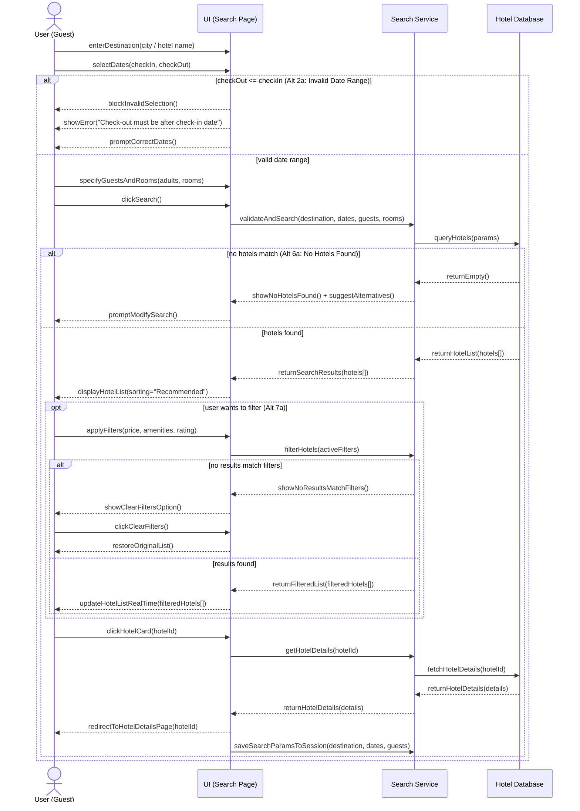

This diagram shows the interaction between the User, UI, Search Service,
and Hotel Database during the hotel search, filtering, and selection flow.
It covers the main flow and alternative scenarios (invalid dates,
no hotels found, empty filter results).

